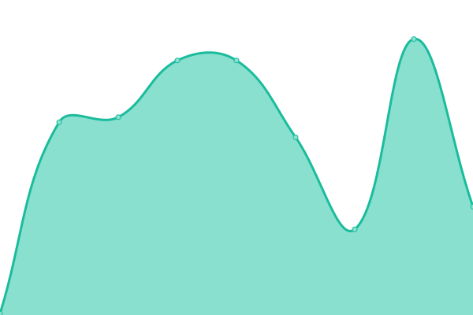

# [📈 Live Status](https://ansg191-lab.github.io/uptime): <!--live status--> **🟩 All systems operational**

This repository contains the open-source uptime monitor and status page for [Anshul Gupta's Lab](https://anshulg.com), powered by [Upptime](https://github.com/upptime/upptime).

With [Upptime](https://upptime.js.org), you can get your own unlimited and free uptime monitor and status page, powered entirely by a GitHub repository. We use [Issues](https://github.com/ansg191-lab/uptime/issues) as incident reports, [Actions](https://github.com/ansg191-lab/uptime/actions) as uptime monitors, and [Pages](https://ansg191-lab.github.io/uptime) for the status page.

<!--start: status pages-->
<!-- This summary is generated by Upptime (https://github.com/upptime/upptime) -->
<!-- Do not edit this manually, your changes will be overwritten -->
<!-- prettier-ignore -->
| URL | Status | History | Response Time | Uptime |
| --- | ------ | ------- | ------------- | ------ |
|  [anshulg.com](https://anshulg.com) | 🟩 Up | [anshulg-com.yml](https://github.com/ansg191-lab/uptime/commits/HEAD/history/anshulg-com.yml) | 

 150ms
     
 | 

<a href="https://status.anshulg.com/history/anshulg-com">100.00%</a>
    

|  [Miniflux](https://miniflux.anshulg.com) | 🟩 Up | [miniflux.yml](https://github.com/ansg191-lab/uptime/commits/HEAD/history/miniflux.yml) | 

 262ms
     
 | 

<a href="https://status.anshulg.com/history/miniflux">100.00%</a>
    

|  [KanIDM](https://auth.anshulg.com) | 🟩 Up | [kan-idm.yml](https://github.com/ansg191-lab/uptime/commits/HEAD/history/kan-idm.yml) | 

 280ms
     
 | 

<a href="https://status.anshulg.com/history/kan-idm">100.00%</a>
    

|  [Git](https://git.anshulg.com) | 🟩 Up | [git.yml](https://github.com/ansg191-lab/uptime/commits/HEAD/history/git.yml) | 

 3070ms
     
 | 

<a href="https://status.anshulg.com/history/git">77.58%</a>
    

|  [Debian Repo](https://apt.anshulg.com) | 🟩 Up | [debian-repo.yml](https://github.com/ansg191-lab/uptime/commits/HEAD/history/debian-repo.yml) | 

 118ms
     
 | 

<a href="https://status.anshulg.com/history/debian-repo">100.00%</a>
    

<!--end: status pages-->

[**Visit our status website →**](https://ansg191-lab.github.io/uptime)

## 📄 License

- Powered by: [Upptime](https://github.com/upptime/upptime)
- Code: [MIT](./LICENSE) © [Anand Chowdhary](https://anandchowdhary.com), supported by [Pabio](https://pabio.com)
- Data in the `./history` directory: [Open Database License](https://opendatacommons.org/licenses/odbl/1-0/)
